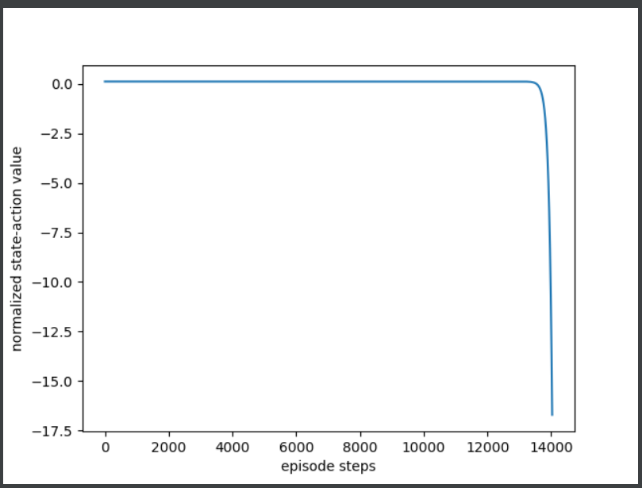
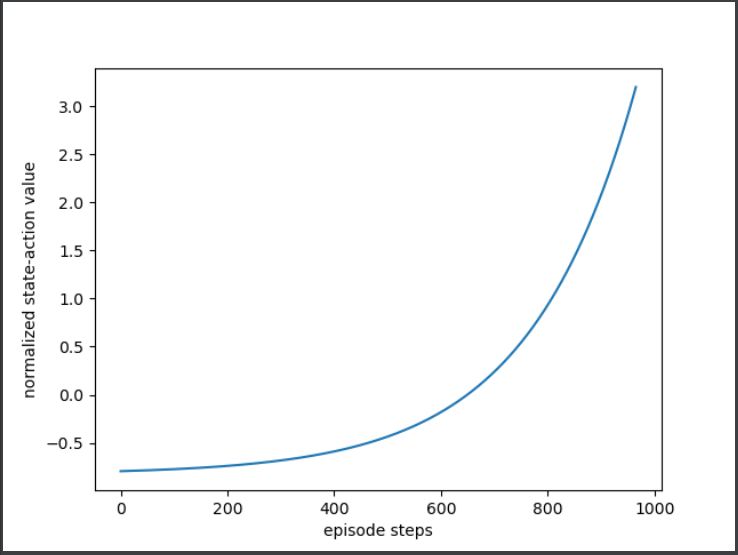

# PolicyGradient
 PolicyGradient agorithm - CartPole and MountainCar

# 算法讲解
Policy Gradient策略梯度算法详解_好程序不脱发的博客-CSDN博客  
https://blog.csdn.net/ningmengzhihe/article/details/130679350

# 软件版本
gym 0.26.2

# 简介
采用基础的PolicyGradient算法玩小游戏

RL_brain.py —— PolicyGradient算法类

run_CarPole.py —— 玩CartPole小游戏主流程

run_MountainCar.py —— 玩MountainCar小游戏流程

玩CartPole小游戏时vt值变化曲线

玩MountainCar小游戏时vt值变化曲线

